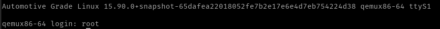
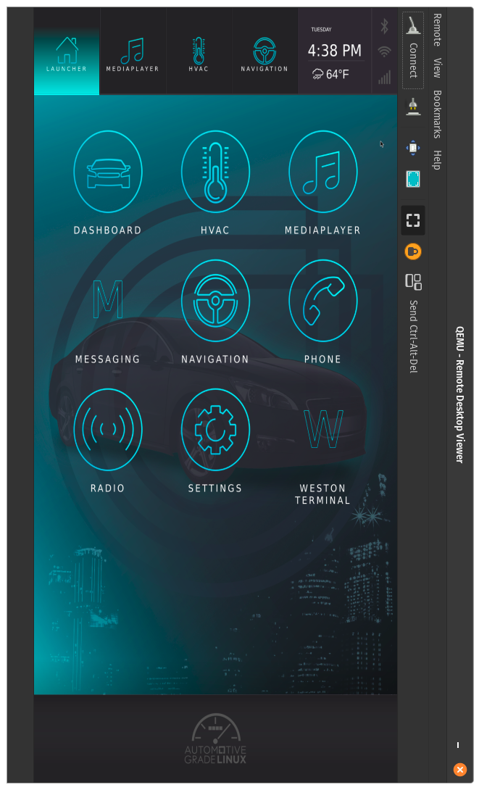

## Getting Hands-On with AGL

### Installing Ready Image (agl-demo)

-> Trying to follow the given documentation at [`AGL -> Getting Started -> Quickstart -> Using Ready Made Images`](https://docs.automotivelinux.org/en/master/#01_Getting_Started/01_Quickstart/01_Using_Ready_Made_Images/)

-> Some steps were missing, such as,
	1. installing qemu_system_x86
	2. the qemu command to load the kernel still has some deprecated things (need to figure out) 

1. Install `qemu`
```bash
sudo apt install qemu qemu-system-x86
```
2. Install `vinagre`
```bash
sudo apt install vinagre
```
3. Install [`Compressed Prebuilt Image`](https://download.automotivelinux.org/AGL/snapshots/master/latest/qemux86-64/deploy/images/qemux86-64/agl-demo-platform-crosssdk-qemux86-64.ext4.xz)  and [`Compressed Kernel Image`](https://download.automotivelinux.org/AGL/snapshots/master/latest/qemux86-64/deploy/images/qemux86-64/bzImage) 
4. Create a boot directory and copy compressed images
```bash
cp ~/Downloads/<prebuilt_image_filename> <repo_filepth>/agl-demo-prebuilt/
cp ~/Downloads/<kernel_image_filename> <repo_filepth>/agl-demo-prebuilt/
cd <repo_filepth>/agl-demo-prebuilt
```
5. Extract [`Compressed Prebuilt Image`](https://download.automotivelinux.org/AGL/snapshots/master/latest/qemux86-64/deploy/images/qemux86-64/agl-demo-platform-crosssdk-qemux86-64.ext4.xz) 
```bash
xz -v -d agl-demo-platform-crosssdk-qemux86-64.ext4.xz
```
7. Boot up the `agl-demo image` on the `qemu` emulator
```bash
qemu-system-x86_64 \
	-device virtio-net-pci,netdev=net0,mac=52:54:00:12:35:02 \
	-netdev user,id=net0,hostfwd=tcp::2222-:22 \
    -drive file=agl-demo-platform-crosssdk-qemux86-64.ext4,if=virtio,format=raw \
    -show-cursor
    -usb -usbdevice tablet -device virtio-rng-pci \
    -snapshot -vga virtio \
    -vnc :0 -soundhw hda -machine q35 
    -cpu kvm64 -cpu qemu64,+ssse3,+sse4.1,+sse4.2,+popcnt \
    -enable-kvm -m 2048 -serial mon:vc -serial mon:stdio -serial null 
    -kernel bzImage \
    -append 'root=/dev/vda rw console=tty0 mem=2048M ip=dhcp oprofile.timer=1 console=ttyS0,115200n8 verbose fstab=no'
```

	You'll be prompted for login-id
	-> enter `root`
	You will now be logged into the agl-demo linux kernal 



8. Run `vinagre` on a seperate terminal
```bash
# create a new terminal

vinagre --vnc-scale localhost
```

	You should now see the AGL-demo-platform on `vinagre` 
